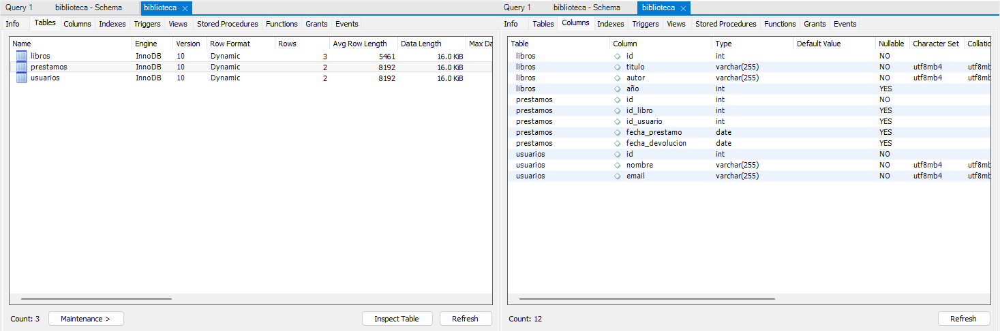
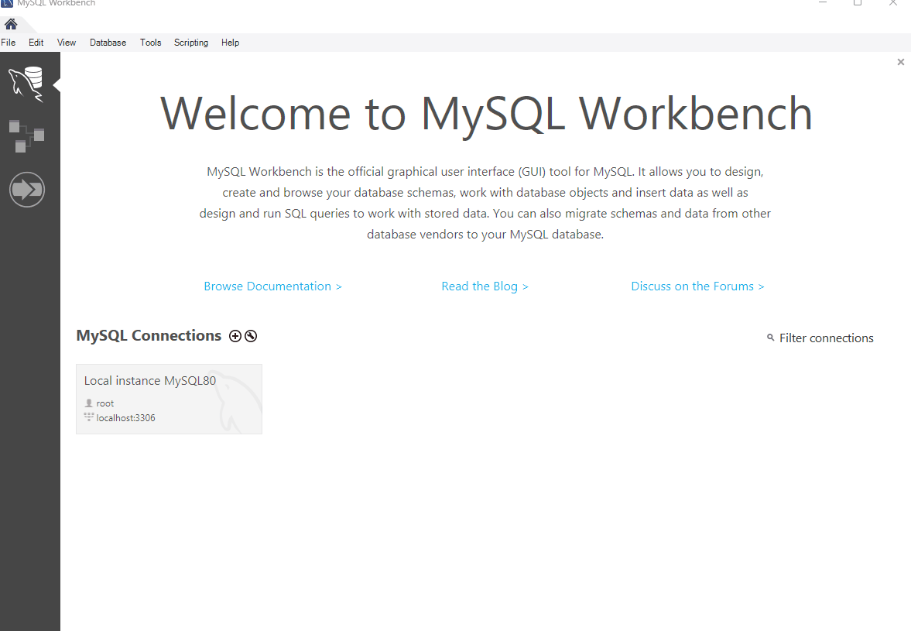

# Base de Datos de una Biblioteca en SQL

Este proyecto es una base de datos relacional que gestiona libros, usuarios y préstamos en una biblioteca. Incluye consultas útiles como mostrar libros prestados, libros disponibles y préstamos vencidos.

## Estructura de la base de datos

## Demo de consultas SQL

## Tecnologías usadas
- MySQL
- SQL

## Cómo ejecutar el proyecto
1. Instala MySQL y MySQL Workbench.
2. Ejecuta el código SQL proporcionado en `biblioteca.sql`.
3. Realiza las consultas necesarias para gestionar la biblioteca.

## Autor
Nahuel Iriart Urruty - [GitHub](https://github.com/tuusuario) | [LinkedIn](https://linkedin.com/in/tuusuario)
